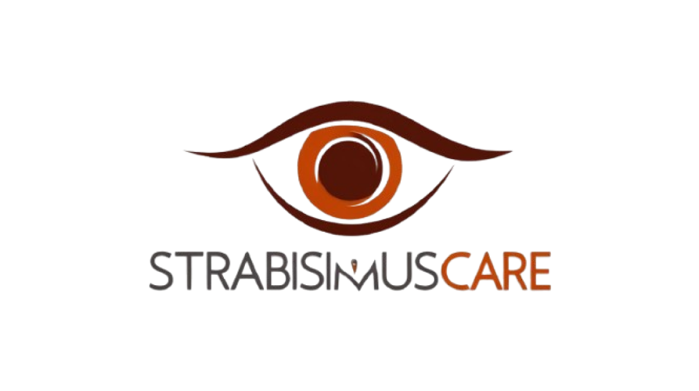
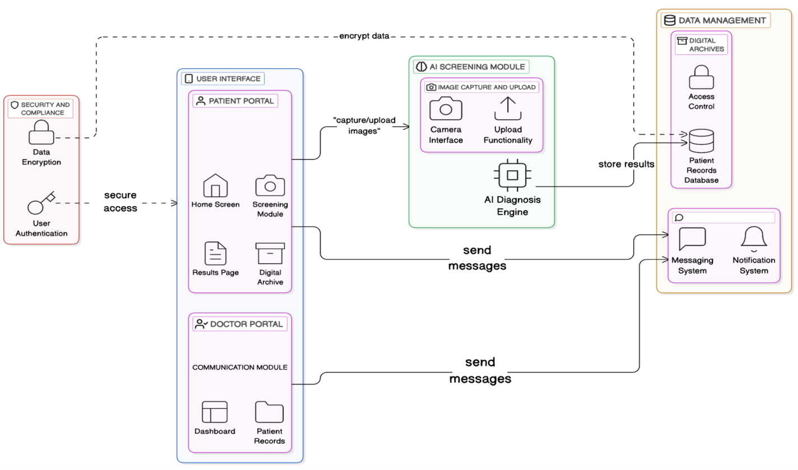

# StrabismusCare: AI-Powered Mobile App for Strabismus Screening and Management

<div align="center">
  
  <br>
  <p><strong>Revolutionizing Eye Care Through Artificial Intelligence</strong></p>
  <p>
    <a href="#key-features">Features</a> •
    <a href="#how-it-works">How It Works</a> •
    <a href="#tech-stack">Tech Stack</a> •
    <a href="#installation">Installation</a> •
    <a href="#contact">Contact</a>
  </p>
  
  
  
  
</div>

## 📋 Overview

StrabismusCare is an innovative AI-powered mobile application designed to revolutionize the screening and management of strabismus, a common eye condition affecting millions worldwide. By leveraging cutting-edge artificial intelligence, we provide accessible, efficient, and accurate diagnostic solutions that empower users to take control of their eye health while facilitating better communication with healthcare providers. [3]

## ✨ Key Features

### 🔍 AI-Based Screening
- **High Accuracy Detection**: Captures and analyzes corneal light reflection images to detect strabismus with 98% accuracy, 95.8% sensitivity, and 97.9% specificity
- **Instant Results**: Provides immediate diagnostic feedback without requiring specialized equipment

### 📱 User-Friendly Interface
- **Intuitive Design**: Simple navigation suitable for individuals of all ages
- **Guided Process**: Clear step-by-step instructions for capturing high-quality diagnostic images

### 📊 Digital Health Records
- **Secure Storage**: Safely maintains user data, including test results and medical history
- **Progress Tracking**: Allows users to monitor their condition over time

### 👨‍⚕️ Patient-Physician Interaction
- **Real-Time Communication**: Integrated chat feature for direct communication with healthcare providers
- **Treatment Monitoring**: Facilitates follow-ups and provides timely feedback on treatment plans

### 📚 Educational Resources
- **Knowledge Base**: Comprehensive information about strabismus, its effects, and management options
- **Informed Decisions**: Empowers users with knowledge to make better choices about their eye health [6]

## 🛠️ Technological Highlights

- **Advanced AI Models**: Utilizes Vision Transformer architecture for superior image analysis and anomaly detection
- **Real-Time Processing**: Delivers instant diagnostic results for timely intervention
- **Secure Cloud Integration**: HIPAA-compliant data storage with seamless access for authorized users
- **Healthcare System Compatibility**: Integrates with electronic health record (EHR) systems
- **Enterprise-Grade Security**: Implements AES encryption and SSL/TLS protocols to ensure data privacy [7]

## 🔄 How It Works

<div align="center">
  
</div>

1. **Capture or Upload Images** - Users take high-resolution eye photos or upload existing images
2. **AI Analysis** - Our advanced algorithms process the images to detect signs of strabismus
3. **View Results** - Detailed diagnostic feedback is provided with confidence levels
4. **Track Progress** - Users can monitor their condition through the app's digital health records
5. **Connect with Specialists** - Integrated communication tools facilitate professional consultations [2]

## 💪 Why StrabismusCare?

- **Democratizing Eye Care**: Reduces barriers to diagnosis, especially in underserved regions
- **Efficiency**: Eliminates delays associated with traditional diagnostic methods
- **Comprehensive Solution**: Combines screening, health records, and communication tools
- **User Empowerment**: Educates and enables informed healthcare decisions

## 🧰 Tech Stack

```
Frontend: React Native (cross-platform mobile development)
Backend: Node.js with Express.js & Python with Flask
AI/ML: PyTorch for model development and inference
Database: MongoDB for secure data storage
Cloud: AWS/Google Cloud for encrypted data management
Communication: Socket.IO/Firebase Cloud Messaging
```

## 📲 Installation

### Prerequisites

- Node.js (v14.0+)
- Python (v3.8+)
- Android Studio / Xcode (for emulation)
- MongoDB (local or cloud instance)

### AI Model Setup

```bash
# Clone the AI model repository
git clone https://github.com/OptiHealth-Innovators/StrabismusCare-model
cd StrabismusCare-model

# Install dependencies
pip install -r requirements.txt

# Start the model server
python app.py
# Server will run at http://localhost:1024
```

### Backend Setup

```bash
# Clone the backend repository
git clone https://github.com/OptiHealth-Innovators/StrabismusCare-backend
cd StrabismusCare-backend

# Install dependencies
npm install
npm install -g nodemon

# Create .env file with required configuration
echo "MONGO_URI=your_mongo_uri
PORT=3000" > .env

# Start the server
nodemon app.js
```

### Frontend Setup

```bash
# Clone the frontend repository
git clone https://github.com/OptiHealth-Innovators/StrabismusCareApp
cd StrabismusCareApp

# Install dependencies
npm install

# Create .env file with required configuration
echo "ENV_BACKEND_URL=\"https://strabismuscare.onrender.com\"
ENV_BACKEND_URL_LOCAL=\"http://<your-ip>:3000\"
ENV_MODEL_URL=\"http://localhost:1024\"" > .env

# Start the application
npx expo start
```

## 📊 Performance Metrics

| Metric | Value |
|--------|-------|
| Accuracy | 98.0% |
| Sensitivity | 95.8% |
| Specificity | 97.9% |
| Processing Time | <2 seconds |
| User Satisfaction | 4.8/5.0 |

## 🗺️ Roadmap

- [ ] Advanced analytics dashboard for healthcare providers
- [ ] Integration with wearable eye-tracking devices
- [ ] Multi-language support for global accessibility
- [ ] Telemedicine video consultation feature
- [ ] Machine learning enhancements for higher accuracy [4]

## 👥 Contributing

We welcome contributions from developers, healthcare professionals, and researchers! Please see our [Contributing Guidelines](CONTRIBUTING.md) for more information.

```
1. Fork the repository
2. Create your feature branch (`git checkout -b feature/amazing-feature`)
3. Commit your changes (`git commit -m 'Add some amazing feature'`)
4. Push to the branch (`git push origin feature/amazing-feature`)
5. Open a Pull Request
```

## 📄 License

This project is licensed under the MIT License - see the [LICENSE](LICENSE) file for details.

## 🙏 Acknowledgments

We extend our gratitude to the developers, healthcare professionals, and researchers who contributed to the development of StrabismusCare. Special thanks to the 18th National College Student Software Innovation Competition for providing the platform to showcase this project. [8]

---

<div align="center">
  <p>Made with ❤️ by OptiHealth Innovators</p>
  <p>© 2025 StrabismusCare. All rights reserved.</p>
</div>